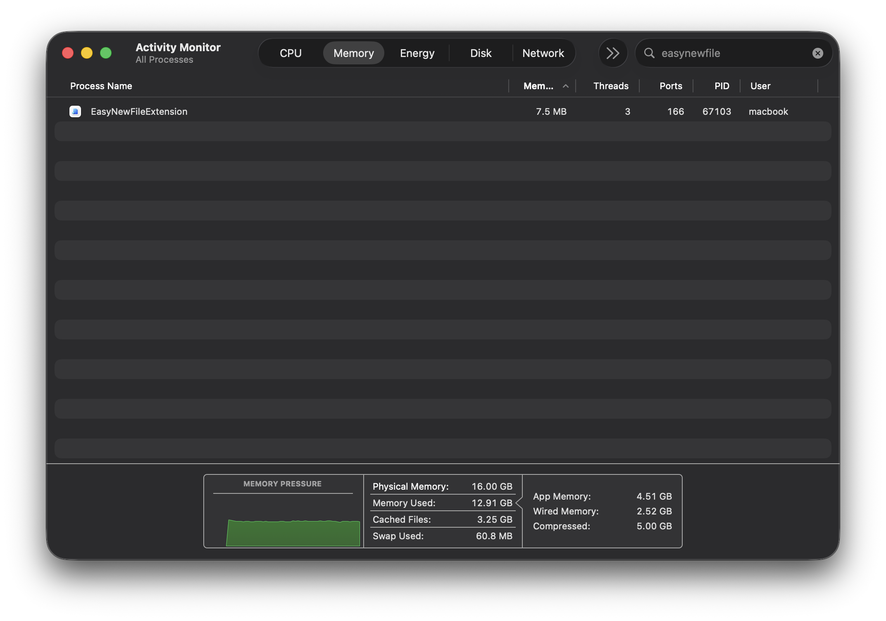

https://github.com/user-attachments/assets/035d4013-770f-4179-ae6e-69607c5bba51

# 🚀 EasyNewFile

[English](#english) | [简体中文](#chinese)

## English

**EasyNewFile** is a minimalist, ultra-lightweight, and open-source Finder extension for macOS. It solves the long-standing pain point: the lack of a "Create New File" option in the Finder right-click menu, while maintaining a native look and feel.

### 🎥 Demonstration

### ✨ Key Features
- **🎨 Native Experience**: Built 100% with SwiftUI and SF Symbols. Seamlessly blends into macOS Monterey, Ventura, and Sonoma.
- **🌓 Auto Theme**: Fully supports Light, Dark, and Auto system themes.
- **⚙️ Customizable**: Switch your preferred default file extension (.txt, .md, .swift, .py, .docx, etc.) instantly via the app settings.
- **🌿 Eco-Friendly**: High performance with an ultra-low footprint (usually < 10MB RAM). No background CPU drain.
- **🔒 Privacy First**: 100% Offline. Strictly follows macOS App Sandbox guidelines. No "Full Disk Access" required.
- **🌐 Localization**: Fully supports **English** and **Simplified Chinese** based on system language.

### ⚙️ Performance

### 📥 Installation
1. **Download**: Get the latest `EasyNewFile.app.zip` from the [Releases](../../releases) page.
2. **Move**: Drag `EasyNewFile.app` to your **Applications** folder. 
   *(Important: The extension may fail if run directly from the Downloads folder.)*
3. **Enable**: 
   - Launch the app and click **"Open System Settings"**.
   - In the "Finder Extensions" list, toggle **EasyNewFile** to ON.
4. **Verify**: Right-click on any empty space in Finder to start creating!

> **⚠️ Security Note**: As an open-source tool without a $99/year developer certificate, macOS may show a "Developer cannot be verified" warning. To open it, **Right-click the App -> Open**, then click **Open** again.

---

## 简体中文

**EasyNewFile** 是一款极简、轻量且开源的 macOS 访达（Finder）右键菜单扩展工具。它填补了访达原生不支持右键新建文件的空白，同时保持了极致的原生审美和极低的资源占用。

### 🎥 功能演示

### ✨ 功能特性
- **🎨 原生视觉**: 100% 采用 SwiftUI 与 SF Symbols 编写，完美契合 macOS 系统审美。
- **🌓 自动适配**: UI 与图标自动适配深色（Dark）、浅色（Light）及自动模式。
- **⚙️ 自定义格式**: 支持在主程序中一键切换默认新建的文件格式（.txt, .md, .swift, .py 等）。
- **🌿 极度轻量**: 静态运行内存占用通常小于 10MB，几乎不产生 CPU 消耗。
- **🔒 隐私安全**: 100% 本地处理。遵循 App Sandbox 规范，无需“完全磁盘访问权限”。
- **🌐 国际化**: 完美支持 **中英文双语**，根据系统语言自动切换。

### ⚙️ 性能表现

### 📥 安装与开启
1. **下载**: 从 [Releases](../../releases) 页面下载最新的 `EasyNewFile.app.zip` 并解压。
2. **移动**: 将 `EasyNewFile.app` 拖入 **应用程序 (Applications)** 文件夹。
   *(注意：由于系统限制，直接在下载文件夹运行可能导致扩展无法加载。)*
3. **开启**: 
   - 打开 App，点击底部的 **“前往系统设置开启扩展”**。
   - 在弹出的“访达扩展”列表中，勾选 **EasyNewFile**。
4. **使用**: 在访达任意空白处点击右键，即可看到“新建文件”选项。

> **⚠️ 风险提示**: 由于本项目为开源作品，未进行苹果官方付费签名，首次打开时可能提示“无法验证开发者”。请通过 **右键点击 App -> 打开**，并在弹出的对话框中点击 **打开** 即可正常使用。

---

### 🛠 Technical Stack / 技术栈
- **Swift 5 / SwiftUI**
- **Finder Sync Extension**
- **App Groups** (Data Sharing)
- **String Catalog** (Localization)

### 📜 License / 开源协议
[MIT License](LICENSE)

**Developed with ❤️ by [AstronautJack](https://github.com/astronautJack)**
